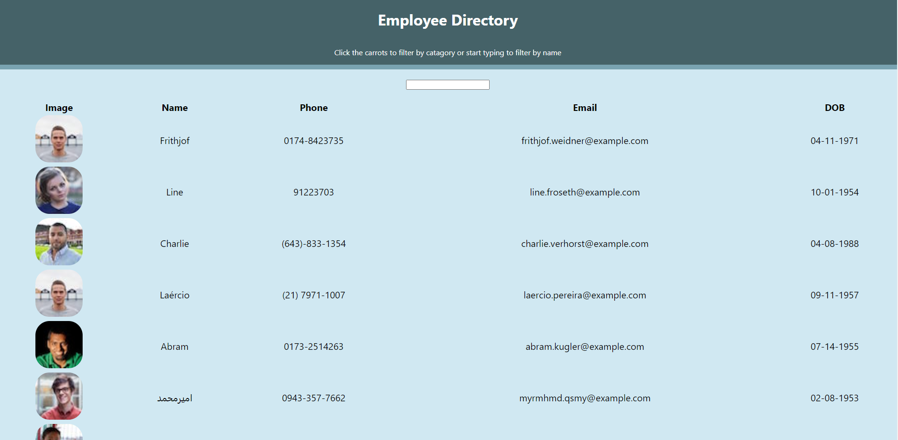

# React Employee Directory

## Project Description 
For this assignment, I created a employee directory with React. It required a break up of the application's UI into components, manage component state, and respond to user events.

<<<<<<< HEAD
When this application is launched, the home page automatically performs an API call and renders a list of 20 users within a Bootstrap table. Users are then able to filter by first name. Users are then able to sort alphabetically by both ascending and descending order for Name, Phone, Email and DOB.
## Installation 

This application is easy to install, just clone the repository and run the following command in your terminal.

`npm install`
This will create the node modules folder you will need in order for this application to function correctly.

## Usage
In order to get this application to run you must open up the terminal and enter the following:

`npm start`
The application will then console log the URL in the terminal and React automatically opens the app in your default browser.

## Screenshots

## Technologies Used
For this application I used: React, JavaScript HTML/CSS, Bootstrap, and Heroku.

 ## Live project
 The project can be viewed here: https://employee-directory-rmc.herokuapp.com/

## API used:
randomuser.me

## Licensing 
The licensing used for this project is MIT

=======
 ## Live project
 The project can be viewed here: https://employee-directory-rmc.herokuapp.com/

## API used:
randomuser.me

## Licensing 
The licensing used for this project is MIT

>>>>>>> 1569f06ccfae131b6f0407b63f973f22710fa1c8
## Contributions 
Author: Rachael McIlhagga
Twitter: @breadlikerach
    
## Questions
* If you have any questions about this project, please reach out to me  through <a href="https://github.com/mcilhaggis">Github</a>  or via <a href="mailto:rachael.mcilhagga@live.co.uk">Email</a>
<<<<<<< HEAD

=======
>>>>>>> 1569f06ccfae131b6f0407b63f973f22710fa1c8
